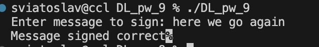

# DL_pw_9
Go implementation of ElGamal signature algorithm

## Requirements 

```bash
* go ^1.19
```

## Installation 

1. Clone repository
```bash
git clone https://github.com/Ozu-bezariusu/DL_pw_9.git
```
```bash
cd DL_pw_9
```

2. Build and Run project
```bash
go build
```
```bash
./DL_pw_9
* Enter message to sign
```


## Usage 

```bash
import (
	elg "DL_pw_9/elg"
)

p, g := elg.PrepareParams(2048)
a, b := elg.GenerateKeys(p, g)

message := []byte("Here we go")

r, s := elg.Sign(p, g, a, b, message)

verification := elg.CheckSignature(p, g, a, b, r, s, message)